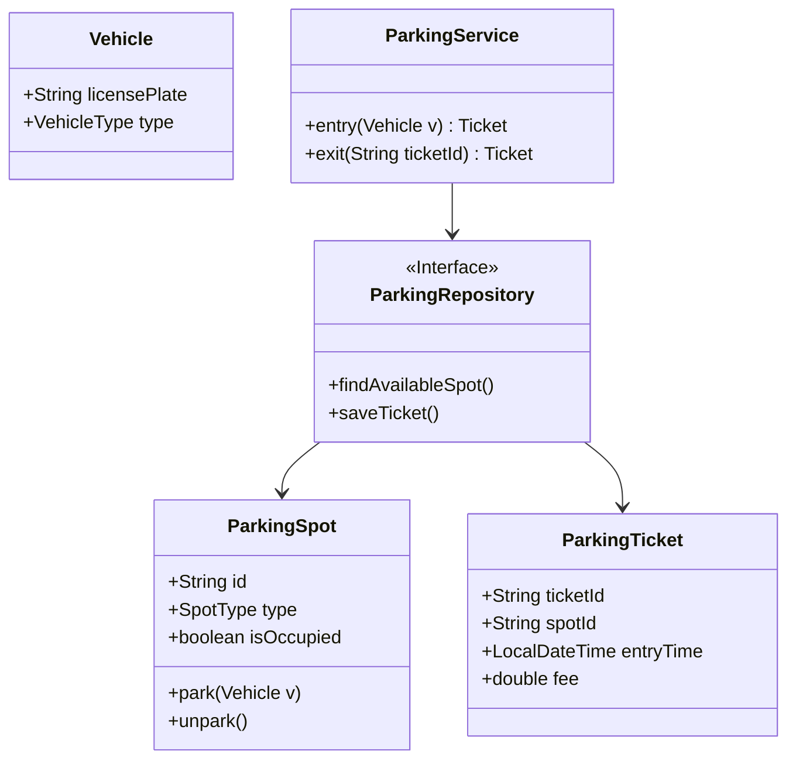

---
Low-Level Design (LLD) for the Parking Lot System
---

### 1) Rough Flow of Program

1. **System Startup:** Initialize the Parking Lot with a fixed number of slots (e.g., 5 Bike spots, 5 Car spots) stored in memory.
2. **User Action (Entry):** User sends a vehicle details (Type, License Plate).
3. **Validation & Assignment:** System checks for the first available spot matching the vehicle type.
4. **Ticket Generation:** If a spot is found, mark it `Occupied` and issue a `Ticket` with a UUID and Entry Time.
5. **User Action (Exit):** User presents the Ticket ID.
6. **Billing & Release:** System calculates the duration, computes the fee, marks the spot `Free`, and returns a receipt.

---

### 2) Functional & Non-Functional Requirements

| Type               | Requirements                                                                                                                                                                                                                                                                                            |
| ------------------ | ------------------------------------------------------------------------------------------------------------------------------------------------------------------------------------------------------------------------------------------------------------------------------------------------------- |
| **Functional**     | 1. **Park Vehicle:** Assign spot strictly based on vehicle type (Bike → Bike Spot).<br><br>2. **Unpark:** Release spot using Ticket ID and calculate fee.<br><br>3. **Capacity:** Limit spots and reject entry if parking is full.<br><br>4. **Ticket:** Track vehicle entry time for accurate billing. |
| **Non-Functional** | 1. **Concurrency:** Must safely handle simultaneous entry and exit requests (Thread-safe).<br><br>2. **Latency:** Entry and exit operations should be low-latency.                                     |

---

### 3) Entities (Properties, Methods & Diagrams)

| Entity | Properties | Key Methods |
| --- | --- | --- |
| **Vehicle** | `licensePlate`, `VehicleType` | `getType()` |
| **ParkingSpot** | `id`, `SpotType`, `isOccupied`, `floorId` | `park(Vehicle)`, `unpark()` |
| **ParkingTicket** | `id`, `vehicleNumber`, `spotId`, `entryTime` | `calculateDuration()` |
| **ParkingLot** | `List<ParkingLevel>`, `id` | `getSnapshot()` |
| **Gate** | `gateId`, `GateType (ENTRY/EXIT)` | `open()`, `close()` |


#### A. Class Diagram (Structure & Relations)



#### B. MVC Data Flow (Execution Path)

1. **Client** calls `POST /api/parking/entry`.
2. **Controller** accepts DTO, converts to `Vehicle` entity.
3. **Service** asks **Repository** for a `BIKE_SPOT`.
4. **Repository** scans `ConcurrentHashMap` for `isOccupied=false`.
5. **Service** locks the spot, generates `Ticket`, returns to Controller.

---

### 4) Relations (OOPS & SOLID Principles)

* **Encapsulation:** All fields in Entities are `private` (via Lombok). Access is controlled via Service methods.
* **Single Responsibility Principle (SRP):**
* `Controller`: Handling HTTP requests only.
* `Service`: Business logic (Fee calculation, Locking).
* `Repository`: Data storage only.


* **Interface Segregation:** The `ParkingRepository` defines only what is needed (find, save, update), keeping the implementation flexible.

---

### 5) Design Patterns Used

| Pattern | Where it is used? |
| --- | --- |
| **Singleton** | Spring Beans (`Service`, `Repository`) are singletons by default. |
| **Strategy Pattern** | (Implicit) The `mapVehicleToSpot` method acts as a strategy to decide which spot suits which vehicle. |
| **DTO Pattern** | Separating `EntryRequest` (API inputs) from internal `Vehicle` entities. |

---

### 6) In-Memory DB vs. Database Selection

**Current Choice:** **In-Memory (ConcurrentHashMap)**

* **Reason:** For interview, setting up a real DB takes too long. A Map provides O(1) access and simulates a "Table".

**If we must choose a real DB:**

| Database | Selection | Reason |
| --- | --- | --- |
| **Relational (PostgreSQL)** | **YES** | **ACID Transactions:** Parking is a resource-constrained system. We cannot allow two cars to book the same spot (Race Condition). Row-level locking in SQL handles this natively. |
| **NoSQL (MongoDB)** | NO | Lack of multi-document transactions (historically) makes strict consistency harder to guarantee without complex logic. |

---

### 7) Architecture

**Style:** **MVC (Model-View-Controller)** in Java Spring Boot.

* **Layered:** Controller \rightarrow Service \rightarrow Repository.

---

### 8) Important Dependencies

| Dependency | Why? |
| --- | --- |
| **spring-boot-starter-web** | Essential for REST APIs (`@RestController`, `@PostMapping`). |
| **lombok** | Drastically reduces code volume (No manual Getters/Setters/Constructors). |
| **java.util.concurrent** | (Native Lib) `ConcurrentHashMap` for thread-safe storage. |

---

### 9) Code Implementation (Complete & Sequential)

#### **Step 1: Entities & Enums**

`VehicleType.java`, `SpotType.java`, `Vehicle.java`, `ParkingSpot.java`, `ParkingTicket.java`

```java

// 1. Enums
public enum VehicleType { 
    CAR, BIKE, TRUCK 
}

public enum SpotType { 
    BIKE_SPOT, CAR_SPOT, LARGE_V_SPOT 
}

// 2. Entities
@Data
@AllArgsConstructor
@NoArgsConstructor
public class Vehicle {
    private String licensePlate;
    private VehicleType type;
}

@Data
public class ParkingSpot {
    private String id;
    private SpotType type;
    private boolean isOccupied;
    private String vehicleLicensePlate;

    public ParkingSpot(String id, SpotType type) {
        this.id = id;
        this.type = type;
        this.isOccupied = false;
    }
}

@Data
@AllArgsConstructor
@NoArgsConstructor
public class ParkingTicket {
    private String ticketId;
    private String spotId;
    private String licensePlate;
    private LocalDateTime entryTime;
    private double fee;
    private boolean isPaid;
}

```

#### **Step 2: DTOs**

`EntryRequest.java`, `ExitRequest.java`

```java

@Data
public class EntryRequest {
    private String licensePlate;
    private VehicleType type;
}

@Data
public class ExitRequest {
    private String ticketId;
}

```

#### **Step 3: Repository (The Storage Layer)**

`ParkingRepository.java` (Interface + Implementation)

```java

public interface ParkingRepository {
    ParkingSpot findAvailableSpot(SpotType type);
    void saveTicket(ParkingTicket ticket);
    ParkingTicket findTicketById(String ticketId);
    void updateSpot(ParkingSpot spot);
    ParkingSpot findSpotById(String spotId);
}

@Repository
public class InMemoryParkingRepository implements ParkingRepository {
    
    // In-memory tables
    private final Map<String, ParkingSpot> spotsTable = new ConcurrentHashMap<>();
    private final Map<String, ParkingTicket> ticketsTable = new ConcurrentHashMap<>();

    public InMemoryParkingRepository() {
        // SEED DATA: Initialize 10 Spots (5 Bike, 5 Car)
        // Note: Using loop to simulate DB IDs
        for (int i = 1; i <= 5; i++) {
            // Create BIKE_SPOTs
            String bikeSpotId = "S-B-" + i;
            spotsTable.put(bikeSpotId, new ParkingSpot(bikeSpotId, SpotType.BIKE_SPOT));

            // Create CAR_SPOTs
            String carSpotId = "S-C-" + i;
            spotsTable.put(carSpotId, new ParkingSpot(carSpotId, SpotType.CAR_SPOT));
        }
        System.out.println("--- DB INITIALIZED: 5 BIKE_SPOTs and 5 CAR_SPOTs created ---");
    }

    @Override
    public ParkingSpot findAvailableSpot(SpotType type) {
        // Simulate: SELECT * FROM spots WHERE occupied=false AND type=? LIMIT 1
        return spotsTable.values().stream()
                .filter(s -> !s.isOccupied() && s.getType() == type)
                .findFirst()
                .orElse(null);
    }

    @Override
    public void saveTicket(ParkingTicket ticket) {
        ticketsTable.put(ticket.getTicketId(), ticket);
    }

    @Override
    public ParkingTicket findTicketById(String ticketId) {
        return ticketsTable.get(ticketId);
    }

    @Override
    public void updateSpot(ParkingSpot spot) {
        spotsTable.put(spot.getId(), spot);
    }
    
    @Override
    public ParkingSpot findSpotById(String spotId) {
        return spotsTable.get(spotId);
    }
}

```

#### **Step 4: Service (The Logic Layer)**

`ParkingService.java`

```java


@Service
@RequiredArgsConstructor
public class ParkingService {

    private final ParkingRepository repository;

    // ENTRY LOGIC
    public synchronized ParkingTicket entry(Vehicle vehicle) {
        // 1. Determine Required Spot Type
        SpotType requiredType = mapVehicleToSpot(vehicle.getType());

        // 2. Find Spot
        ParkingSpot spot = repository.findAvailableSpot(requiredType);
        if (spot == null) {
            throw new RuntimeException("NO PARKING AVAILABLE for type: " + vehicle.getType());
        }

        // 3. Occupy Spot
        spot.setOccupied(true);
        spot.setVehicleLicensePlate(vehicle.getLicensePlate());
        repository.updateSpot(spot);

        // 4. Generate Ticket
        ParkingTicket ticket = new ParkingTicket(
                UUID.randomUUID().toString(),
                spot.getId(),
                vehicle.getLicensePlate(),
                LocalDateTime.now(),
                0.0,
                false
        );
        repository.saveTicket(ticket);
        
        System.out.println("ENTRY SUCCESS: Vehicle " + vehicle.getLicensePlate() + 
                           " parked at " + spot.getId() + " (" + spot.getType() + ")");
        return ticket;
    }

    // EXIT LOGIC
    public synchronized ParkingTicket exit(String ticketId) {
        // 1. Validate Ticket
        ParkingTicket ticket = repository.findTicketById(ticketId);
        if (ticket == null) throw new RuntimeException("Ticket Not Found");
        if (ticket.isPaid()) throw new RuntimeException("Ticket Already Paid");

        // 2. Calculate Fee
        long durationHours = Duration.between(ticket.getEntryTime(), LocalDateTime.now()).toHours();
        if (durationHours == 0) durationHours = 1; // Min 1 hour charge
        
        double rate = 10.0; // Flat rate $10/hr
        ticket.setFee(durationHours * rate);
        ticket.setPaid(true);
        repository.saveTicket(ticket);

        // 3. Free the Spot
        ParkingSpot spot = repository.findSpotById(ticket.getSpotId());
        if (spot != null) {
            spot.setOccupied(false);
            spot.setVehicleLicensePlate(null);
            repository.updateSpot(spot);
        }

        System.out.println("EXIT SUCCESS: Ticket " + ticketId + " paid $" + ticket.getFee());
        return ticket;
    }

    // Helper: Strategy to map Vehicle -> Spot
    private SpotType mapVehicleToSpot(VehicleType vt) {
        switch (vt) {
            case BIKE: return SpotType.BIKE_SPOT;
            case CAR:  return SpotType.CAR_SPOT;
            case TRUCK: return SpotType.LARGE_V_SPOT;
            default: throw new IllegalArgumentException("Unknown Vehicle Type");
        }
    }
}

```

#### **Step 5: Controller (The API Layer)**

`ParkingController.java`

```java


@RestController
@RequestMapping("/api/parking")
@RequiredArgsConstructor
public class ParkingController {

    private final ParkingService service;

    @PostMapping("/entry")
    public ResponseEntity<ParkingTicket> entry(@RequestBody EntryRequest request) {
        Vehicle v = new Vehicle(request.getLicensePlate(), request.getType());
        return ResponseEntity.ok(service.entry(v));
    }

    @PostMapping("/exit")
    public ResponseEntity<ParkingTicket> exit(@RequestBody ExitRequest request) {
        return ResponseEntity.ok(service.exit(request.getTicketId()));
    }
}

```

#### **Step 6: Main Class with Demo**

`ParkingApplication.java`

```java


@SpringBootApplication
public class ParkingApplication {

    public static void main(String[] args) {
        // 1. Start Spring Context
        ConfigurableApplicationContext context = SpringApplication.run(ParkingApplication.class, args);
        
        // 2. Get Service Bean manually to run demo
        ParkingService service = context.getBean(ParkingService.class);

        // 3. Run Simulation
        System.out.println("\n========== SIMULATION STARTED ==========");
        try {
            // --- SCENARIO 1: Bike Entry ---
            System.out.println("\n[1] Bike Attempting to Park...");
            Vehicle bike = new Vehicle("KA-01-BIKE", VehicleType.BIKE);
            ParkingTicket bikeTicket = service.entry(bike);
            // Expect: Allocated Spot: S-B-X (Type BIKE_SPOT)

            // --- SCENARIO 2: Car Entry ---
            System.out.println("\n[2] Car Attempting to Park...");
            Vehicle car = new Vehicle("MH-02-CAR", VehicleType.CAR);
            ParkingTicket carTicket = service.entry(car);
            // Expect: Allocated Spot: S-C-X (Type CAR_SPOT)

            // --- SCENARIO 3: Car Exit ---
            System.out.println("\n[3] Car Exiting...");
            // Thread sleep to simulate time passing (optional, keeping it 0 so fee is min $10)
            service.exit(carTicket.getTicketId());

        } catch (Exception e) {
            System.err.println("SIMULATION FAILED: " + e.getMessage());
        }
        System.out.println("\n========== SIMULATION ENDED ==========");
    }
}

```

---

### 10) Optimization Ideas (Post-Interview Discussion)

1. **Concurrency Locking:** The current code uses `synchronized` on methods. This locks the *entire* service. **Optimization:** Use a `ReentrantLock` per Floor or per Spot to allow multiple cars to park on different floors simultaneously.
2. **Database Indexing:** Index `isOccupied` and `type` columns to make `SELECT * FROM spots WHERE...` lightning fast.
3. **Caching:** Use Redis to store just the counter `AvailableSpots = 50`. When a car enters, decrement Redis. If 0, reject immediately (saves DB Load).

---
