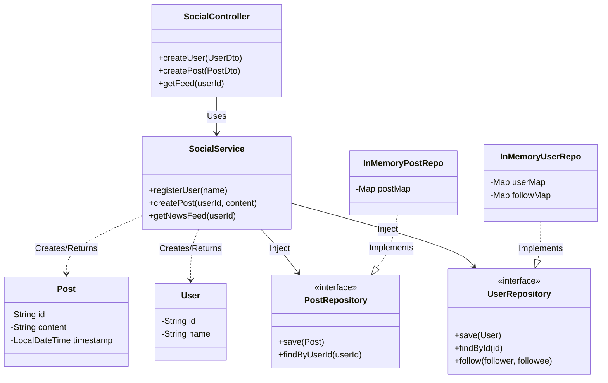
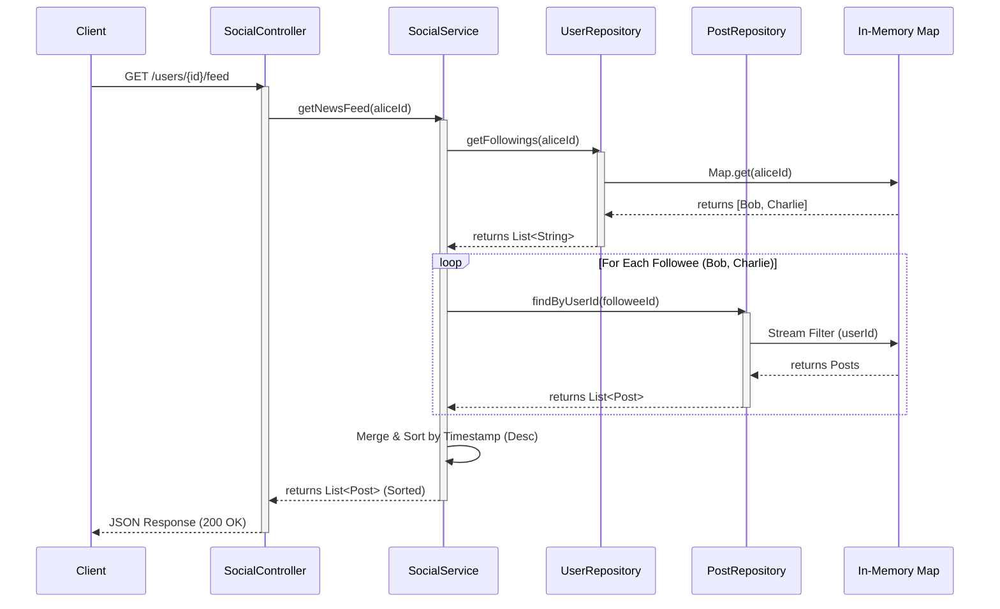

### 1) Functional and Non-functional Requirements

**Functional Requirements (MVP)**

* **User Management:** Register, get profile.
* **Social Graph:** Follow/Unfollow users.
* **Content:** Create text posts.
* **News Feed:** View a timeline of posts from followed users (Reverse Chronological).

**Non-Functional Requirements**

* **Read Heavy:** The system is read-heavy (viewing feeds happens more than posting).
* **Low Latency:** Feed generation must be fast (< 200ms).
* **Availability:** System should be highly available (CAP theorem -> AP preferred for feed).
* **Scalability:** Interfaces should support switching to scalable databases.

---

### 2) Rough Flow of Program

1. **Onboard:** User A and User B register.
2. **Connect:** User A follows User B.
3. **Action:** User B creates a `Post`.
4. **Retrieval:** User A requests their `News Feed`.
5. **Logic:** System fetches posts from A's followings (B), sorts by time, and returns.

---

### 3) Entities (Properties and Methods)

| Entity | Properties | Core Methods/Responsibility |
| --- | --- | --- |
| **User** | `id`, `name`, `email`, `password` | Store user profile details. |
| **Post** | `id`, `userId`, `content`, `timestamp` | Store post data. |
| **Connection** | `followerId`, `followeeId`, `createdAt` | Manage directed graph edges (Follows). |

Here are the diagrams representing the structure and flow of the Social Media Platform LLD.

#### A. Class Diagram (Structure & Relations)

This diagram illustrates the **Dependency Inversion Principle** (Service depends on Interfaces) and the **Repository Pattern**.



---

#### B. MVC Data Flow (Execution Path)

This sequence diagram shows the execution flow for the **"Get News Feed"** feature (The most complex read operation in this MVP).



---

### 4) Relations (OOP & SOLID)

* **User 1 : N Post** (One user has many posts).
* **User M : N User** (Self-referential Many-to-Many for "Follows").
* **SRP (Single Responsibility):** Separate `UserService` (Profile/Graph) from `PostService` (Content/Feed).
* **DIP (Dependency Inversion):** Services depend on `Repository` interfaces, not concrete `HashMap` implementations.

---

### 5) Design Patterns

| Pattern | Usage in Design |
| --- | --- |
| **Repository Pattern** | To abstract data access. Allows swapping In-Memory map with SQL/NoSQL easily. |
| **Service Layer** | Encapsulates business logic (e.g., Feed generation logic). |
| **Strategy Pattern** | (Optional extension) For different Feed Ranking algorithms (Chronological vs. AI Ranked). |
| **Singleton** | Spring Beans (Services, Controllers) are singletons by default. |

---

### 6) In-Memory Strategy & Database Selection

**In-Memory Design:**
We will use `ConcurrentHashMap` to simulate tables. This ensures thread safety during the demo.

**Database Selection (If moving to Production):**

| Data Type | Recommended DB | Reason |
| --- | --- | --- |
| **User Profile** | **MySQL / PostgreSQL** | Structured data, ACID compliance required for account integrity. |
| **Posts / Feed** | **Cassandra / DynamoDB** | High write throughput, massive scale, flexible schema, time-series optimized. |
| **Social Graph** | **Neo4j** (or SQL for simple) | Graph DBs are optimized for traversal queries (e.g., "Friends of Friends"). |

---

### 7) Architecture

**MVC (Model-View-Controller)** in Spring Boot:

* **Controller:** Handles HTTP requests (`@RestController`).
* **Service:** Business Logic (`@Service`).
* **Repository:** Data Access (`@Repository`).

---

### 8) Important Dependencies

| Dependency | Purpose |
| --- | --- |
| `spring-boot-starter-web` | Provides REST API support (Tomcat, MVC). |
| `lombok` | Reduces boilerplate (Getters, Setters, Constructors). |
| `spring-boot-starter-test` | For unit testing (JUnit/Mockito). |

---

### 9) Code Implementation

**Sequence:** Entity -> DTO -> Repository -> Service -> Controller -> Main Simulation.

#### A. Entities

```java


@Data
@AllArgsConstructor
@NoArgsConstructor
public class User {
    private String id;
    private String name;
}

@Data
@AllArgsConstructor
@NoArgsConstructor
public class Post {
    private String id;
    private String userId;
    private String content;
    private LocalDateTime timestamp;
}

```

#### B. DTOs (Data Transfer Objects)

```java


@Data
public class PostDto {
    private String content;
    private String userId;
}

@Data
public class UserDto {
    private String name;
}

```

#### C. Repositories (Interface + In-Memory Impl)

```java


// Interface allows easy swap to JPA later
public interface UserRepository {
    User save(User user);
    Optional<User> findById(String id);
    void follow(String followerId, String followeeId);
    List<String> getFollowings(String followerId);
}

public interface PostRepository {
    Post save(Post post);
    List<Post> findByUserId(String userId);
}

// --- Implementations ---

@Repository
class InMemoryUserRepo implements UserRepository {
    private final Map<String, User> userMap = new ConcurrentHashMap<>();
    // Key: Follower, Value: Set of Followees
    private final Map<String, Set<String>> followMap = new ConcurrentHashMap<>();

    @Override
    public User save(User user) {
        userMap.put(user.getId(), user);
        return user;
    }

    @Override
    public Optional<User> findById(String id) {
        return Optional.ofNullable(userMap.get(id));
    }

    @Override
    public void follow(String followerId, String followeeId) {
        followMap.computeIfAbsent(followerId, k -> ConcurrentHashMap.newKeySet()).add(followeeId);
    }

    @Override
    public List<String> getFollowings(String followerId) {
        return new ArrayList<>(followMap.getOrDefault(followerId, Collections.emptySet()));
    }
}

@Repository
class InMemoryPostRepo implements PostRepository {
    private final Map<String, Post> postMap = new ConcurrentHashMap<>();

    @Override
    public Post save(Post post) {
        postMap.put(post.getId(), post);
        return post;
    }

    @Override
    public List<Post> findByUserId(String userId) {
        return postMap.values().stream()
                .filter(p -> p.getUserId().equals(userId))
                .collect(Collectors.toList());
    }
}

```

#### D. Services

```java


@Service
@RequiredArgsConstructor
public class SocialService {

    private final UserRepository userRepo;
    private final PostRepository postRepo;

    // --- User Operations ---
    public User registerUser(String name) {
        User user = new User(UUID.randomUUID().toString(), name);
        return userRepo.save(user);
    }

    public void follow(String followerId, String followeeId) {
        if(userRepo.findById(followerId).isPresent() && userRepo.findById(followeeId).isPresent()){
            userRepo.follow(followerId, followeeId);
            System.out.println("User " + followerId + " followed " + followeeId);
        }
    }

    // --- Post Operations ---
    public Post createPost(String userId, String content) {
        Post post = new Post(UUID.randomUUID().toString(), userId, content, LocalDateTime.now());
        return postRepo.save(post);
    }

    // --- Feed Generation (Pull Model) ---
    public List<Post> getNewsFeed(String userId) {
        List<String> followings = userRepo.getFollowings(userId);
        List<Post> feed = new ArrayList<>();

        // Aggregate posts from all followees
        for (String followeeId : followings) {
            feed.addAll(postRepo.findByUserId(followeeId));
        }

        // Sort by Time (Reverse Chronological)
        feed.sort(Comparator.comparing(Post::getTimestamp).reversed());
        return feed;
    }
}

```

#### E. Controller

```java


@RestController
@RequestMapping("/api")
@RequiredArgsConstructor
public class SocialController {

    private final SocialService socialService;

    @PostMapping("/users")
    public User createUser(@RequestBody UserDto userDto) {
        return socialService.registerUser(userDto.getName());
    }

    @PostMapping("/posts")
    public Post createPost(@RequestBody PostDto postDto) {
        return socialService.createPost(postDto.getUserId(), postDto.getContent());
    }

    @PostMapping("/users/{id}/follow/{targetId}")
    public void follow(@PathVariable String id, @PathVariable String targetId) {
        socialService.follow(id, targetId);
    }

    @GetMapping("/users/{id}/feed")
    public List<Post> getFeed(@PathVariable String id) {
        return socialService.getNewsFeed(id);
    }
}

```

#### F. Main Method (Simulation)

```java

@SpringBootApplication
public class SocialApp {

    public static void main(String[] args) {
        // 1. Initialize Spring Context
        ConfigurableApplicationContext context = SpringApplication.run(SocialApp.class, args);

        // 2. Fetch Service Bean
        SocialService service = context.getBean(SocialService.class);

        System.out.println("---------- SIMULATION START ----------");

        // 3. Register Users
        User alice = service.registerUser("Alice");
        User bob = service.registerUser("Bob");
        User charlie = service.registerUser("Charlie");

        // 4. Create Connections (Alice follows Bob & Charlie)
        service.follow(alice.getId(), bob.getId());
        service.follow(alice.getId(), charlie.getId());

        // 5. Bob and Charlie create posts
        service.createPost(bob.getId(), "Hello from Bob! #first");
        
        // Simulating time delay for sorting check
        try { Thread.sleep(100); } catch (InterruptedException e) {} 
        
        service.createPost(charlie.getId(), "Charlie here! #weekend");

        // 6. Fetch Alice's Feed
        List<Post> aliceFeed = service.getNewsFeed(alice.getId());

        System.out.println("\n--- Feed for " + alice.getName() + " ---");
        for (Post p : aliceFeed) {
            System.out.println("Time: " + p.getTimestamp() + " | Content: " + p.getContent());
        }

        System.out.println("---------- SIMULATION END ----------");
    }
}

```

---

### 10) Optimization Ideas

| Feature | Optimization Strategy |
| --- | --- |
| **Feed Latency** | **Fan-out on Write:** When a user posts, push that post ID to all followers' pre-computed feed lists immediately (Redis). Fast read, slower write. |
| **Pagination** | Use Cursor-based pagination (e.g., `last_post_id`, `limit=10`) instead of offset pagination to handle infinite scroll efficiently. |
| **Hot Users** | For celebrities (millions of followers), use **Pull Model** (fetch on demand) to avoid clogging the system with fan-out writes. |
| **Caching** | Cache User Profiles and Hot Feeds in **Redis** (TTL 5 mins). |

---
