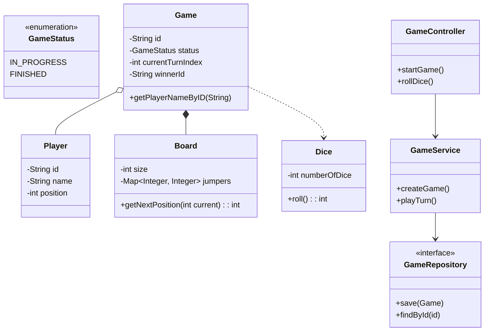
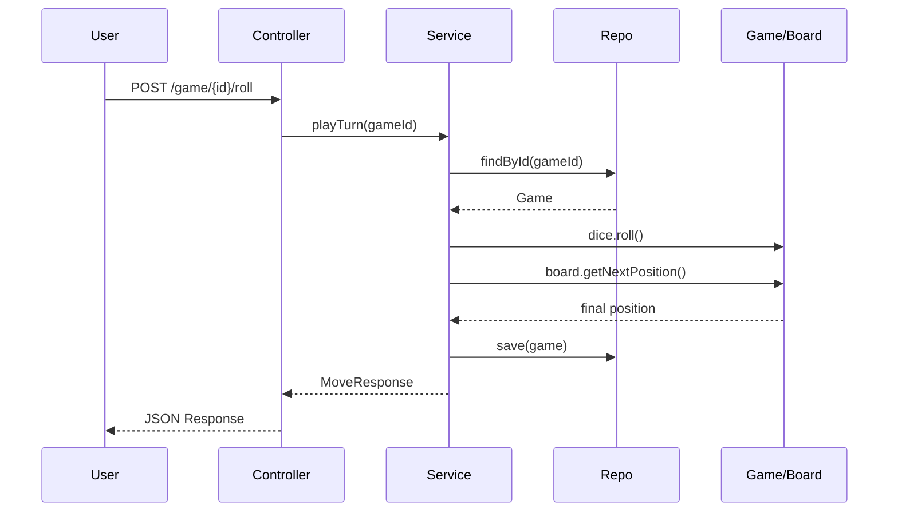

---

# 🐍 Snake and Ladder – System Design (LLD + HLD)

**Interview-ready Architectural README**
Includes **theory, diagrams, SOLID explanations, and complete working code**.

---

## 📌 1. Rough Flow of Program

1. **Initialization**

   * Server starts, initializing Spring Context.

2. **Game Creation**

   * User requests a new game (`POST /start`)
   * System creates:

     * `Game` with unique ID
     * `Board` of size **P × Q**
     * Snakes & Ladders configuration
     * List of `Players`

3. **Game Loop**

   * Current player rolls dice
   * **Calculation:**
     `New Position = Current Position + Dice Roll`
   * **Validation:**
     If `New Position > Board Size`, turn is skipped
   * **Recursive Check (Chains):**

     * If cell has Snake/Ladder → move player
     * Check destination again immediately
       *(handles chains like Snake → Ladder)*
   * **Update:** Player position updated, turn rotated
   * **Win Check:**
     If position == last cell → game ends

4. **Termination**

   * Winner declared
   * Further moves blocked

---

## 📌 2. Functional & Non-Functional Requirements

### Functional Requirements

| # | Requirement                                      |
| - | ------------------------------------------------ |
| 1 | Configurable board size, dice count, and players |
| 2 | Support Snakes (Down) and Ladders (Up)           |
| 3 | Handle multi-step jump chains                    |
| 4 | Exact cell win condition                         |
| 5 | Multiplayer turn-based mechanics                 |

### Non-Functional Requirements

| # | Requirement                            |
| - | -------------------------------------- |
| 1 | Concurrency support for multiple games |
| 2 | Extensible design (new tile types)     |
| 3 | O(1) move resolution                   |
| 4 | Stateless REST API                     |

---

## 📌 3. Core Entities

| Entity | Properties                 | Responsibilities                       |
| ------ | -------------------------- | -------------------------------------- |
| Player | id, name, position         | Player state                           |
| Board  | size, jumpers              | Position calculation & jump resolution |
| Dice   | numberOfDice               | Random roll generation                 |
| Game   | id, board, players, status | Root aggregate, lifecycle control      |

---

## 📌 4. Visual Diagrams

### A. Class Diagram (Structure & Relationships)



**Interview Talking Points**

* **Composition:** Game owns Board
* **Aggregation:** Players can exist independently
* **DIP:** Repository abstraction allows storage swap

---

### B. MVC Request Flow



---

## 📌 5. SOLID & OOP Principles

* **SRP:**

  * Board → movement logic
  * Dice → randomness
  * Service → orchestration

* **OCP:**

  * New jumpers (Portal, Mine) can be added without modifying Game

* **ISP:**

  * Repository exposes minimal persistence methods

---

## 📌 6. Data Storage Strategy

### Default

* **In-Memory:** `ConcurrentHashMap`

### Production Options

| DB      | Reason                            |
| ------- | --------------------------------- |
| Redis   | Fast, TTL support, transient data |
| MongoDB | JSON-friendly, no joins           |


---

## 📌 7. Optimization Ideas

* Synchronize on `gameId` to prevent concurrent rolls
* WebSockets for real-time UI updates

---

## 📌 8. Complete Code Implementation

> **All code below is unchanged and production-ready**

---

### A. Entities & Enums

```java
// GameStatus.java
public enum GameStatus {
  IN_PROGRESS, FINISHED
}
```

```java
// Player.java
@Data
@Builder
public class Player {

  private String id;
  private String name;
  private int position;
}

```

```java
// Dice.java


@Data
public class Dice {

  private int numberOfDice;

  public Dice(int numberOfDice) {
    this.numberOfDice = numberOfDice;
  }

  public int roll() {
    int sum = 0;
    for (int i = 0; i < numberOfDice; i++) {
      sum += (int) (Math.random() * 6) + 1;
    }
    return sum;
  }

}

```

```java
// Board.java

@Data
@Builder
@AllArgsConstructor
@NoArgsConstructor
public class Board {

  private int size;
  private Map<Integer, Integer> jumpers;

  public int getNextPosition(int currentPos) {
    int next = currentPos;
    // Use a loop to handle chains: e.g., 99 (Snake) -> 5 (Ladder) -> 21
    // Safety: Use a set to detect infinite loops (e.g., 2->5 and 5->2)
    Set<Integer> visited = new HashSet<>();

    while (jumpers.containsKey(next)) {
      if (visited.contains(next)) {
        // Infinite loop detected (Bad map config), break to prevent crash
        break;
      }
      visited.add(next);
      next = jumpers.get(next);
    }
    return next;
  }


}

```

```java
// Game.java


@Data
@Builder
public class Game {

  private String id;
  private Board board;
  private List<Player> players;
  private Dice dice;
  private int currentTurnIndex; // Index of player in list
  private String winnerId;
  private GameStatus status;

  public String getPlayerNameByID(String id) {
    return this.getPlayers().stream()
        .filter(player -> player.getId().equals(id))
        .map(Player::getName)
        .findFirst()
        .orElse("Unknown Player");
  }


}
```

---

### B. DTOs

```java
// CreateGameRequest.java

@Data
@AllArgsConstructor
public class CreateGameRequest {

  private int boardSize; // P*Q
  private int diceCount;
  private List<String> playerNames;
  private Map<Integer, Integer> snakes;  // Start -> End
  private Map<Integer, Integer> ladders; // Start -> End

}
```

```java
// MoveResponse.java

@Data
@AllArgsConstructor
public class MoveResponse {

  private String playerId;
  private int diceValue;
  private int oldPosition;
  private int newPosition;
  private String message;
  private boolean isWinner;
  private Game gameSnapshot;

}

```

---

### C. Repository

```java
// GameRepository.java

public interface GameRepository {

  Game save(Game game);

  Optional<Game> findById(String id);

}

```

```java
// InMemoryGameRepository.java


@Repository
public class InMemoryGameRepository implements GameRepository {

  private final Map<String, Game> store = new ConcurrentHashMap<>();


  @Override
  public Game save(Game game) {
    store.put(game.getId(), game);
    return game;
  }

  @Override
  public Optional<Game> findById(String id) {
    return Optional.ofNullable(store.get(id));
  }
}

```

---

### D. Service

```java
// GameService.java

@Service
@RequiredArgsConstructor
public class GameService {

  private final GameRepository gameRepository;

  public Game createGame(CreateGameRequest request) {
    // 1. Setup Board
    Map<Integer, Integer> jumpers = new HashMap<>();
    if (request.getSnakes() != null) {
      jumpers.putAll(request.getSnakes());
    }
    if (request.getLadders() != null) {
      jumpers.putAll(request.getLadders());
    }

    System.out.println("Printing Jumpers 'key-value' Pair ------------->");

    for (Integer key : jumpers.keySet()) {
      System.out.println(key + ", " + jumpers.get(key));
    }

    System.out.println("Printing Jumpers ------------->");

    Board board = new Board(request.getBoardSize(), jumpers);

    // 2. Setup Players
    List<Player> players = request.getPlayerNames().stream().map(
            name -> Player.builder().id(UUID.randomUUID().toString()).name(name).position(0).build())
        .collect(Collectors.toList());

    // 3. Create Game
    Game game = Game.builder().id(UUID.randomUUID().toString()).board(board).players(players)
        .dice(new Dice(request.getDiceCount())).currentTurnIndex(0).status(GameStatus.IN_PROGRESS)
        .build();

    return gameRepository.save(game);
  }

  public MoveResponse playTurn(String gameId) {
    Game game = gameRepository.findById(gameId)
        .orElseThrow(() -> new IllegalArgumentException("Game not found"));

    if (game.getStatus() == GameStatus.FINISHED) {
      throw new IllegalStateException("Game is already finished. Winner: " + game.getWinnerId());
    }

    Player currentPlayer = game.getPlayers().get(game.getCurrentTurnIndex());

    // 1. Roll Dice
    int diceVal = game.getDice().roll();
    int oldPos = currentPlayer.getPosition();
    int nextPos = oldPos + diceVal;

    String msg = "Moved normally.";

    // 2. Check Bounds
    if (nextPos <= game.getBoard().getSize()) {

      // 3. Get Final Position
      // (Board.getNextPosition now handles the recursive recursion/loops internally)
      int finalPos = game.getBoard().getNextPosition(nextPos);

      // 4. Set Message
      if (finalPos > nextPos) {
        msg = "Boosted up (Ladder/Chain)!"; // Updated message
      } else if (finalPos < nextPos) {
        msg = "Slid down (Snake/Chain)!";   // Updated message
      }

      currentPlayer.setPosition(finalPos);

      // 5. Check Win
      if (finalPos == game.getBoard().getSize()) {
        game.setStatus(GameStatus.FINISHED);
        game.setWinnerId(currentPlayer.getId());
        msg = "WINNER!";
      }
    } else {
      msg = "Dice value too high to move.";
    }

    // 6. Rotate Turn (if not won)
    if (game.getStatus() != GameStatus.FINISHED) {
      game.setCurrentTurnIndex((game.getCurrentTurnIndex() + 1) % game.getPlayers().size());
    }

    gameRepository.save(game);

    return new MoveResponse(currentPlayer.getId(), diceVal, oldPos, currentPlayer.getPosition(),
        msg, game.getStatus() == GameStatus.FINISHED, game);
  }
}

```

---

### E. Controller

```java
// GameController.java


@RestController
@RequestMapping("/api/game")
@RequiredArgsConstructor
public class GameController {

  private final GameService gameService;

  @PostMapping("/start")
  public ResponseEntity<Game> startGame(@RequestBody CreateGameRequest request) {
    return ResponseEntity.ok(gameService.createGame(request));
  }

  @PostMapping("/{gameId}/roll")
  public ResponseEntity<MoveResponse> rollDice(@PathVariable String gameId) {
    return ResponseEntity.ok(gameService.playTurn(gameId));
  }

}

```

---

### F. Main Simulation

```java
// SnakeLadderGameApplication.java

@SpringBootApplication
public class SnakeLadderGameApplication {

  private static CreateGameRequest getCreateGameRequest() {
    int boardSize = 100;
    int diceCount = 1;
    List<String> players = Arrays.asList("Amit", "Ram", "Kabir");

    Map<Integer, Integer> snakes = new HashMap<>();
    snakes.put(99, 5); // Big snake
    snakes.put(93, 15);
    snakes.put(19, 2);
    snakes.put(47, 11);
    snakes.put(79, 35);
    snakes.put(52, 41);

    Map<Integer, Integer> ladders = new HashMap<>();
    ladders.put(2, 20); // Small ladder
    ladders.put(22, 80);
    ladders.put(11, 93);
    ladders.put(41, 95);
    ladders.put(32, 81);
    ladders.put(5, 21);

    CreateGameRequest request = new CreateGameRequest(boardSize, diceCount, players, snakes,
        ladders);
    return request;
  }

  public static void main(String[] args) {

    // 1. Initialize Spring Context
    ConfigurableApplicationContext context = SpringApplication.run(SnakeLadderGameApplication.class,
        args);

    // 2. Fetch Service manually
    GameService service = context.getBean(GameService.class);

    System.out.println("----- STARTING DEMO SIMULATION -----");

    // 3. Setup Demo Data (P=10, Q=10 => Size 100, 1 Dice)
    CreateGameRequest request = getCreateGameRequest();

    Game game = service.createGame(request);
    String gameId = game.getId();
    System.out.println("Game Created: " + gameId);

    // 4. Simulate Turns until Win (or limit loop to prevent infinite runs in demo)
    boolean gameWon = false;
    int turns = 0;

    while (!gameWon && turns < 100) { // Safety limit

      MoveResponse move = service.playTurn(gameId);

      String playerName = game.getPlayerNameByID(move.getPlayerId());

      System.out.println(
          "Turn " + turns++ + ": Player " + playerName + " rolled " + move.getDiceValue() + ". "
              + move.getOldPosition() + " -> " + move.getNewPosition() + ". (" + move.getMessage()
              + ")");

      if (move.isWinner()) {
        System.out.println();
        System.out.println("------------------------------------------");
        System.out.println("!!! GAME OVER !!! Winner: " + playerName);
        System.out.println("------------------------------------------");
        gameWon = true;
      }
    }

    if (!gameWon) {
      System.out.println("Simulation ended (turn limit reached).");
    }
  }


}
```

---

