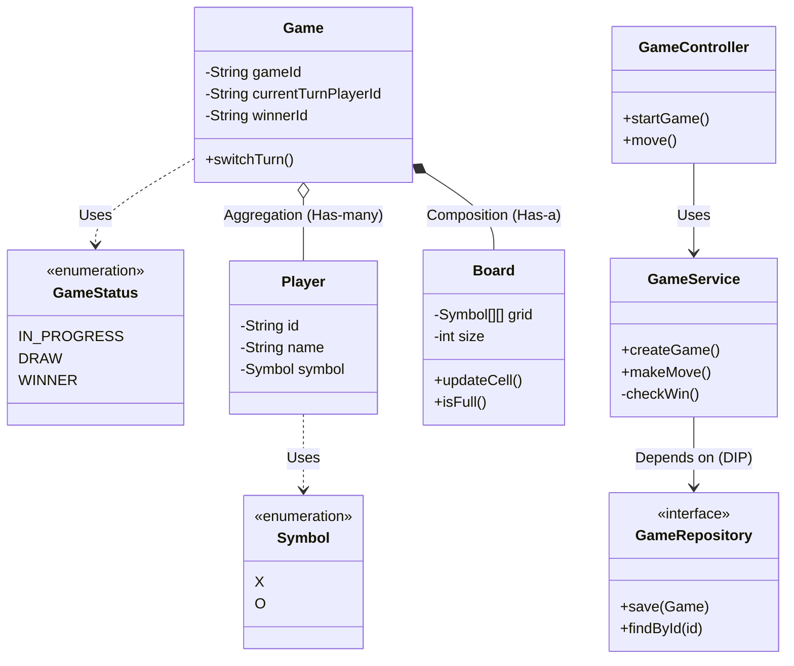
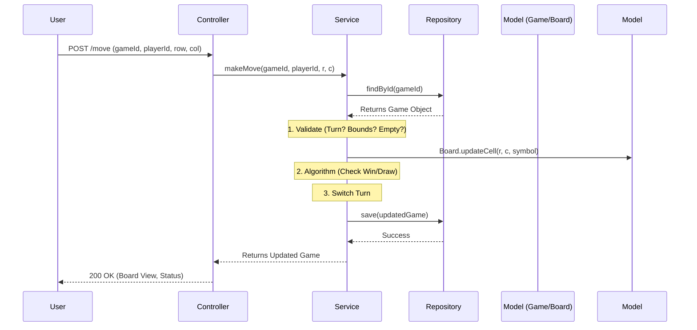

Here is the **Architectural README** (HLD + LLD) tailored for your interview preparation. 

-----

# README: Tic-Tac-Toe System Design (LLD)

## 1\) Rough Flow of Program

1.  **Initialization:** Server starts, initializing Spring Context and the Game Service.
2.  **Game Creation:** User A requests a new game; System creates a `Game` instance with a unique ID, two `Player` objects, and an empty $3\times3$ `Board`.
3.  **Game Loop:**
      * Current player sends a move (Row, Col).
      * **Validation:** System checks bounds, turn order, and if the cell is empty.
      * **Update:** Board is updated; Turn is switched.
      * **Check Status:** System calculates if there is a Winner or Draw after the move.
4.  **Termination:** If a terminal state (Win/Draw) is reached, the game status is updated, and the winner is announced.

-----

## 2\) Functional & Non-Functional Requirements

| Type | Requirements |
| :--- | :--- |
| **Functional** | 1. **Start Game:** Initialize board and players.<br>2. **Make Move:** Accept coordinates from valid player.<br>3. **Validation:** Ensure valid moves and correct turn.<br>4. **Win/Draw Algo:** Check $3\times3$ grid for winning lines.<br>5. **Game State:** Retrieve board view and status. |
| **Non-Functional** | 1. **Concurrency:** Handle simultaneous games and thread-safe state updates.<br>2. **Extensibility:** Interface-based storage (easy swap from memory to DB).<br>3. **Maintainability:** Clean MVC separation. |

-----

## 3\) Entities (Properties & Methods)

| Entity | Properties | Key Responsibilities |
| :--- | :--- | :--- |
| **Player** | `id`, `name`, `symbol` (X/O) | Holds user details. |
| **Board** | `size` ($N$), `grid` ($N\times N$ Matrix) | Manages grid state, initializes cells. |
| **Game** | `gameId`, `board`, `players`, `status`, `winnerId`, `currentTurn` | **Root Aggregate.** Manages game lifecycle, turn switching, and orchestration. |
| **Move** | `playerId`, `row`, `col` | DTO to capture user intent. |

Here are the visual representations of the system design. I have provided both the **Class Diagram** (structural view) and the **MVC Data Flow** (execution view) using Mermaid syntax, which you can draw on a whiteboard during an interview.

### A\. Class Diagram (Structure & Relations)

This diagram highlights the SOLID principles and Object-Oriented relationships (Composition vs. Aggregation).



**Key Interview Talking Points for Class Diagram:**

  * **Composition (`*--`):** `Game` controls the lifecycle of `Board`. If the Game is deleted, the Board is gone.
  * **Aggregation (`o--`):** Players are independent entities. A player can exist even if the specific `Game` instance is destroyed.
  * **Dependency Injection:** `GameService` depends on the `GameRepository` interface, allowing us to swap the storage mechanism easily.

-----

### B\. MVC Data Flow (Execution Path)

This diagram shows how a "Make Move" request travels through the layers.



**Key Interview Talking Points for Data Flow:**

  * **Statelessness:** The Controller is stateless; it just passes data.
  * **Fat Service / Thin Controller:** All validation logic (Is it this player's turn? Is the cell empty?) happens in the Service, not the Controller.
  * **Atomic State:** We fetch the full Game state, modify it in memory, and save it back. This ensures data consistency.

-----

## 4\) Relations (OOP & SOLID Principles)

  * **Composition:** `Game` **has-a** `Board`. The Board cannot exist meaningfully without the Game context.
  * **Aggregation:** `Game` **has** `Players`. Players can exist independently (e.g., in a user profile system) before joining a game.
  * **SRP (Single Responsibility):**
      * `Board`: Only cares about grid data.
      * `GameService`: Only cares about rules and flow.
      * `Controller`: Only cares about HTTP/Input parsing.
  * **DIP (Dependency Inversion):** Service depends on `GameRepository` (Interface), not `InMemoryGameRepository` (Implementation).

-----

## 5\) Design Patterns

  * **Singleton Pattern:** Spring Beans (`Service`, `Controller`, `Repository`) are Singletons by default to save memory.
  * **Repository Pattern:** Abstracts the data layer. Allows switching between In-Memory map and SQL/NoSQL without touching business logic.
  * **Strategy Pattern (Potential):** Can be used for the `WinningStrategy` (e.g., if we switch from $3\times3$ to $N\times N$ or Connect-4 rules), though simple logic is used here for speed.

-----

## 6\) Data Storage Strategy

**Default Implementation:** In-Memory using `ConcurrentHashMap` for $O(1)$ access and thread safety during the interview demo.

**Database Selection (If Persistence is required):**

| DB Type | Recommendation | Reason |
| :--- | :--- | :--- |
| **NoSQL** | **MongoDB** | **Selected.** A Game is a self-contained "Document". The Board (nested array) and Players fit naturally into a JSON structure. Fetching `GameById` retrieves the entire state instantly without complex SQL joins. |
| **RDBMS** | PostgreSQL | Use only if we need complex analytics (e.g., "Find all games won by X in \< 5 moves"). Storing a 2D grid requires serialization or a separate `Cells` table, which adds overhead. |

-----

## 7\) Architecture (MVC)

We follow the standard **Spring Boot MVC** layered architecture:

1.  **Controller Layer (`GameController`):** Entry point. Handles HTTP Requests (`POST /start`, `POST /move`). Maps JSON to DTOs.
2.  **Service Layer (`GameService`):** The "Brain". Handles validation, turn switching, and the Win/Draw algorithm.
3.  **Repository Layer (`GameRepository`):** The "Store". Interface for `save()` and `findById()`.
4.  **Domain Layer (`Game`, `Board`):** POJOs representing the business data.

-----

## 8\) Important Dependencies

| Dependency | Why it is needed? |
| :--- | :--- |
| `spring-boot-starter-web` | Provides the embedded Tomcat server and DispatcherServlet for REST API handling. |
| `lombok` | Removes boilerplate code. Generates Getters, Setters, Constructors, and `toString` automatically via annotations (`@Data`, `@AllArgsConstructor`). Crucial for coding speed in interviews. |

-----

## 9\) Implementation Sequence (Logical Order)

1.  **Define Entities:** Create `Player`, `Board`, and `Game` classes. Use Lombok.
2.  **Define DTOs:** Create Request objects (`ConnectGameRequest`, `GameplayRequest`) to sanitize inputs.
3.  **Create Repository Interface:** Define `save` and `find` contract.
4.  **Implement Repository:** Create `InMemoryGameRepository` using a `Map`.
5.  **Build Service Logic:**
      * Method to create game.
      * Method to execute move (Validation -\> Update Board -\> Check Win -\> Switch Turn).
6.  **Build Controller:** Expose Endpoints connecting to Service.
7.  **Main Method:** Initialize Context, fetch Service bean, and run the `Scanner` loop for the demo.

-----

## 10\) Optimization Ideas

  * **Caching:** Introduce **Redis** to cache `Game` objects. Since game state changes rapidly (every few seconds), reading from memory (Redis) is faster than hitting a disk-based DB.
  * **Concurrency:** Use `Optimistic Locking` (`@Version` in JPA or equivalent in Mongo) if two players try to move simultaneously, though the turn-based nature mitigates this.
  * **Communication:** Upgrade from REST (Request-Response) to **WebSockets** (STOMP protocol) so players receive board updates instantly without polling the server.

-----

### 9\) Code Implementation

#### A. Entities & Enums

```java
package com.tictactoe.model;

public enum Piece { X, O }

public enum GameStatus { IN_PROGRESS, DRAW, WINNER }
```

```java
package com.tictactoe.model;

import lombok.Data;

@Data
public class Player {
    private String id;
    private String name;
    private Piece piece;

    public Player(String name, Piece piece) {
        this.name = name;
        this.piece = piece;
        this.id = java.util.UUID.randomUUID().toString();
    }
}
```

```java
package com.tictactoe.model;

import lombok.Data;

@Data
public class Board {
    private int size;
    private Piece[][] grid;
    private int movesCount;

    public Board(int size) {
        this.size = size;
        this.grid = new Piece[size][size];
        this.movesCount = 0;
    }

    public boolean isValidMove(int row, int col) {
        return row >= 0 && row < size && col >= 0 && col < size && grid[row][col] == null;
    }

    public void setPiece(int row, int col, Piece piece) {
        grid[row][col] = piece;
        movesCount++;
    }

    public boolean isFull() {
        return movesCount == size * size;
    }
    
    // Simple O(N) check for the specific cell last moved
    public boolean checkWin(int row, int col, Piece piece) {
        boolean rowWin = true, colWin = true, diag1 = true, diag2 = true;

        for (int i = 0; i < size; i++) {
            if (grid[row][i] != piece) rowWin = false;
            if (grid[i][col] != piece) colWin = false;
            if (grid[i][i] != piece) diag1 = false;
            if (grid[i][size - 1 - i] != piece) diag2 = false;
        }
        return rowWin || colWin || diag1 || diag2;
    }
}
```

```java
package com.tictactoe.model;

import lombok.Data;
import java.util.List;
import java.util.UUID;

@Data
public class Game {
    private String gameId;
    private Board board;
    private List<Player> players;
    private int currentTurnIndex; // 0 or 1
    private GameStatus status;
    private Player winner;

    public Game(int boardSize, Player p1, Player p2) {
        this.gameId = UUID.randomUUID().toString();
        this.board = new Board(boardSize);
        this.players = List.of(p1, p2);
        this.currentTurnIndex = 0;
        this.status = GameStatus.IN_PROGRESS;
    }
    
    public Player getCurrentPlayer() {
        return players.get(currentTurnIndex);
    }

    public void switchTurn() {
        currentTurnIndex = (currentTurnIndex + 1) % 2;
    }
}
```

#### B. DTOs

```java
package com.tictactoe.dto;

import lombok.AllArgsConstructor;
import lombok.Data;

@Data
@AllArgsConstructor
public class MoveRequest {
    private String gameId;
    private int row;
    private int col;
}
```

#### C. Repository (Interface + In-Memory Impl)

```java
package com.tictactoe.repo;

import com.tictactoe.model.Game;
import java.util.Optional;

public interface GameRepository {
    Game save(Game game);
    Optional<Game> findById(String gameId);
}
```

```java
package com.tictactoe.repo;

import com.tictactoe.model.Game;
import org.springframework.stereotype.Repository;
import java.util.Map;
import java.util.Optional;
import java.util.concurrent.ConcurrentHashMap;

@Repository
public class InMemoryGameRepository implements GameRepository {
    private final Map<String, Game> gameStore = new ConcurrentHashMap<>();

    @Override
    public Game save(Game game) {
        gameStore.put(game.gameId(), game); // .gameId() if using record or getGameId()
        return game;
    }

    @Override
    public Optional<Game> findById(String gameId) {
        return Optional.ofNullable(gameStore.get(gameId));
    }
}
```

#### D. Service

```java
package com.tictactoe.service;

import com.tictactoe.dto.MoveRequest;
import com.tictactoe.model.*;
import com.tictactoe.repo.GameRepository;
import org.springframework.stereotype.Service;

@Service
public class GameService {

    private final GameRepository gameRepository;

    public GameService(GameRepository gameRepository) {
        this.gameRepository = gameRepository;
    }

    public Game createGame(String player1Name, String player2Name) {
        Player p1 = new Player(player1Name, Piece.X);
        Player p2 = new Player(player2Name, Piece.O);
        Game game = new Game(3, p1, p2);
        return gameRepository.save(game);
    }

    public Game makeMove(MoveRequest request) {
        Game game = gameRepository.findById(request.getGameId())
                .orElseThrow(() -> new RuntimeException("Game not found"));

        if (game.getStatus() != GameStatus.IN_PROGRESS) {
            throw new RuntimeException("Game is already finished");
        }

        Board board = game.getBoard();
        Player currentPlayer = game.getCurrentPlayer();

        if (!board.isValidMove(request.getRow(), request.getCol())) {
            throw new RuntimeException("Invalid Move");
        }

        // Execute Move
        board.setPiece(request.getRow(), request.getCol(), currentPlayer.getPiece());

        // Check Win
        if (board.checkWin(request.getRow(), request.getCol(), currentPlayer.getPiece())) {
            game.setStatus(GameStatus.WINNER);
            game.setWinner(currentPlayer);
        } else if (board.isFull()) {
            game.setStatus(GameStatus.DRAW);
        } else {
            game.switchTurn();
        }

        return gameRepository.save(game);
    }
    
    public Game getGame(String gameId) {
        return gameRepository.findById(gameId).orElse(null);
    }
}
```

#### E. Controller

```java
package com.tictactoe.controller;

import com.tictactoe.dto.MoveRequest;
import com.tictactoe.model.Game;
import com.tictactoe.service.GameService;
import org.springframework.http.ResponseEntity;
import org.springframework.web.bind.annotation.*;

@RestController
@RequestMapping("/game")
public class GameController {

    private final GameService gameService;

    public GameController(GameService gameService) {
        this.gameService = gameService;
    }

    @PostMapping("/start")
    public ResponseEntity<Game> startGame(@RequestParam String p1, @RequestParam String p2) {
        return ResponseEntity.ok(gameService.createGame(p1, p2));
    }

    @PostMapping("/move")
    public ResponseEntity<Game> makeMove(@RequestBody MoveRequest request) {
        return ResponseEntity.ok(gameService.makeMove(request));
    }
}
```

#### F. Main Method (Simulation Demo)

```java
package com.tictactoe;

import com.tictactoe.dto.MoveRequest;
import com.tictactoe.model.Game;
import com.tictactoe.service.GameService;
import org.springframework.boot.SpringApplication;
import org.springframework.boot.autoconfigure.SpringBootApplication;
import org.springframework.context.ConfigurableApplicationContext;

@SpringBootApplication
public class TicTacToeApplication {

    public static void main(String[] args) {
        // Initialize Spring Context
        ConfigurableApplicationContext context = SpringApplication.run(TicTacToeApplication.class, args);
        
        // Manually fetch Service Bean
        GameService gameService = context.getBean(GameService.class);

        System.out.println("--- Starting Simulation ---");

        // 1. Create Game
        Game game = gameService.createGame("Alice", "Bob");
        String gameId = game.getGameId();
        System.out.println("Game Created: " + gameId);
        System.out.println("Current Turn: " + game.getCurrentPlayer().getName());

        // 2. Make Moves (Simulate a Win for X)
        // X moves (0,0)
        game = gameService.makeMove(new MoveRequest(gameId, 0, 0));
        System.out.println("Move (0,0) by X. Next: " + game.getCurrentPlayer().getName());

        // O moves (1,0)
        game = gameService.makeMove(new MoveRequest(gameId, 1, 0));
        System.out.println("Move (1,0) by O. Next: " + game.getCurrentPlayer().getName());

        // X moves (0,1)
        game = gameService.makeMove(new MoveRequest(gameId, 0, 1)); 
        System.out.println("Move (0,1) by X. Next: " + game.getCurrentPlayer().getName());

        // O moves (1,1)
        game = gameService.makeMove(new MoveRequest(gameId, 1, 1));
        System.out.println("Move (1,1) by O. Next: " + game.getCurrentPlayer().getName());

        // X moves (0,2) -> WIN
        game = gameService.makeMove(new MoveRequest(gameId, 0, 2));
        System.out.println("Move (0,2) by X.");
        
        // 3. Result
        System.out.println("--- Game Over ---");
        System.out.println("Status: " + game.getStatus());
        if (game.getWinner() != null) {
            System.out.println("Winner: " + game.getWinner().getName());
        }
    }
}
```

-----

